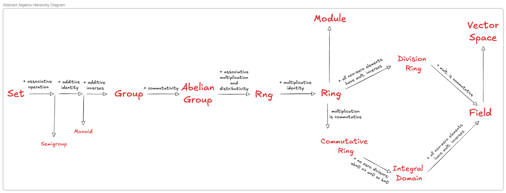

# The Hierarchy of Abstract Algebra

*Published: September 8, 2026*
*Category: Abstract Algebra*

Algebraic structures are built by starting with a [set](https://en.wikipedia.org/wiki/Set_(mathematics)) and layering axioms one at a time. Each new axiom carves the previous class into a smaller, better-behaved subclass. This post walks the path from a bare set to a [field](https://en.wikipedia.org/wiki/Field_(mathematics)), naming each structure at the point it appears.

*The main road runs Set → Group → Abelian Group → Rng → Ring → Field. Side branches (Semigroup, Monoid, Module, Vector Space, Division Ring, Commutative Ring, Integral Domain) mark structures that sit off the main line.*

## Contents

1. [One operation: from Set to Group](#one-op)
2. [Commutativity: the Abelian Group](#abelian)
3. [Two operations: Rng and Ring](#two-ops)
4. [The right-hand branches](#branches)
5. [Modules and Vector Spaces](#modules)

---

## 1. One operation: from Set to Group

Start with a set $S$ and add a single [binary operation](https://en.wikipedia.org/wiki/Binary_operation) $\cdot : S \times S \to S$. Each axiom you impose gives the resulting structure a name.

- **[Semigroup](https://en.wikipedia.org/wiki/Semigroup).** The operation is [associative](https://en.wikipedia.org/wiki/Associative_property): $(a \cdot b) \cdot c = a \cdot (b \cdot c)$.
- **[Monoid](https://en.wikipedia.org/wiki/Monoid).** A semigroup with an [identity element](https://en.wikipedia.org/wiki/Identity_element) $e$ satisfying $e \cdot a = a \cdot e = a$.
- **[Group](https://en.wikipedia.org/wiki/Group_(mathematics)).** A monoid in which every element has an [inverse](https://en.wikipedia.org/wiki/Inverse_element): for each $a$ there is $a^{-1}$ with $a \cdot a^{-1} = a^{-1} \cdot a = e$.

The diagram writes the operation additively (identity, inverses) because the same chain will next attach a multiplication on top.

<strong>Intuition.</strong> Each step adds exactly one axiom: associativity turns a set into a semigroup, an identity turns it into a monoid, inverses turn it into a group.

---

## 2. Commutativity: the Abelian Group

An [**abelian group**](https://en.wikipedia.org/wiki/Abelian_group) is a group whose operation is [commutative](https://en.wikipedia.org/wiki/Commutative_property): $a \cdot b = b \cdot a$ for all $a, b$.

Commutativity is the last axiom needed before a *second* operation can sensibly be layered on top. The additive part of every ring, module, and vector space is required to be an abelian group.

---

## 3. Two operations: Rng and Ring

Take an abelian group $(R, +)$ and add a second binary operation, multiplication, that is associative and distributes over addition:

$$a(b + c) = ab + ac, \qquad (a + b)c = ac + bc.$$

- **[Rng](https://en.wikipedia.org/wiki/Rng_(algebra))** (pronounced "rung"). The structure so far: an abelian group with an associative, distributive multiplication. No multiplicative identity is required.
- **[Ring](https://en.wikipedia.org/wiki/Ring_(mathematics)).** A rng with a multiplicative identity $1$ satisfying $1 \cdot a = a \cdot 1 = a$.

The dropped "i" in *rng* is a deliberate pun: a rng is a ring without the *i*dentity.

---

## 4. The right-hand branches

From a ring, three independent axioms split off distinct subclasses.

- **[Commutative ring](https://en.wikipedia.org/wiki/Commutative_ring).** Multiplication is commutative: $ab = ba$.
- **[Integral domain](https://en.wikipedia.org/wiki/Integral_domain).** A commutative ring with no [zero divisors](https://en.wikipedia.org/wiki/Zero_divisor): $ab = 0 \Rightarrow a = 0$ or $b = 0$.
- **[Division ring](https://en.wikipedia.org/wiki/Division_ring).** A ring in which every non-zero element has a multiplicative inverse. Not required to be commutative — the [quaternions](https://en.wikipedia.org/wiki/Quaternion) $\mathbb{H}$ are the standard example.
- **[Field](https://en.wikipedia.org/wiki/Field_(mathematics)).** A commutative division ring. Equivalently, an integral domain in which every non-zero element has a multiplicative inverse.

The diagram shows the two paths that meet at "field":

$$\text{Ring} \longrightarrow \text{Division Ring} \xrightarrow{\text{comm.}} \text{Field}, \qquad \text{Ring} \longrightarrow \text{Commutative Ring} \longrightarrow \text{Integral Domain} \xrightarrow{\text{inverses}} \text{Field}.$$

Show why every finite integral domain is a field

Let $D$ be a finite integral domain and fix a non-zero $a \in D$. The map $x \mapsto ax$ is [injective](https://en.wikipedia.org/wiki/Injective_function): if $ax = ay$ then $a(x - y) = 0$, and no zero divisors forces $x = y$. An injective map from a finite set to itself is [surjective](https://en.wikipedia.org/wiki/Surjective_function), so some $x$ satisfies $ax = 1$. That $x$ is $a^{-1}$.

---

## 5. Modules and Vector Spaces

The upper branch of the diagram attaches an *external* operation.

- **[Module](https://en.wikipedia.org/wiki/Module_(mathematics)) over a ring $R$.** An abelian group $M$ together with a scalar multiplication $R \times M \to M$ satisfying the usual distributivity, associativity, and identity axioms.
- **[Vector space](https://en.wikipedia.org/wiki/Vector_space).** A module whose scalar ring is a field.

Modules generalise vector spaces by replacing the scalar field with a ring. Most of the pathological behaviour in module theory — [torsion](https://en.wikipedia.org/wiki/Torsion_(algebra)), lack of a basis, projective versus free — disappears exactly when the ring is upgraded to a field.

---

<strong>Sneak peek.</strong> The next post picks up at "module over a ring" and works out the structure theorem for finitely generated modules over a principal ideal domain — the result that unifies the Jordan and rational canonical forms.

